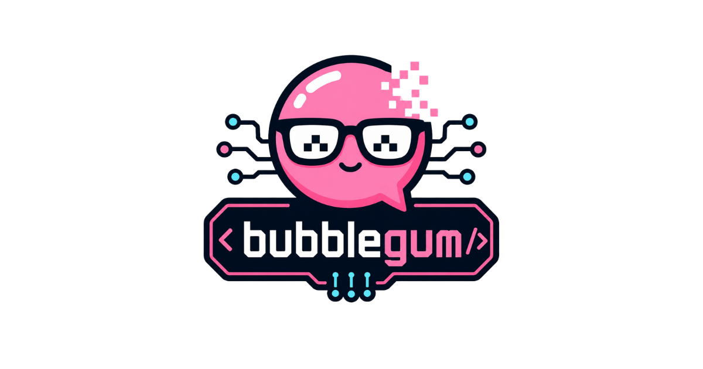

<picture>
  <source media="(prefers-color-scheme: dark)" srcset="assets/header.png">
  
</picture>

<p align="center">
  <strong>Claude Code rodando com GLM 5.2 e DeepSeek V4.</strong><br>
  Mesmo loop de agentes, edição de arquivos, bash, subagentes.<br>
  <em>80–95% mais barato que o preço oficial da Anthropic.</em>
</p>

<p align="center">
  <a href="#instalação"></a>
  <a href="#instalação"></a>
  <a href="#windows"></a>
  <br>
  
  
  
  
</p>

---

## O que é?

O **bubblegum** é um wrapper minúsculo que troca o backend do Claude Code por modelos muito mais baratos — sem perder o loop de agentes, as ferramentas, a edição de arquivos nem os subagentes.

```
bubblegum              → GLM 5.2 (Zhipu AI, MIT)
bubblegum --deepseek   → DeepSeek V4 Pro
bubblegum --anthropic  → Anthropic oficial
```

Não é proxy. Não é fork. É só o Claude Code normal apontando pra outro endpoint — os dois backends já falam o protocolo Anthropic Messages API nativamente.

---

## Por que isso importa?

| Backend | Modelo | Input / 1M tokens | Output / 1M tokens | 1 dia pesado* |
|---------|--------|-------------------|--------------------|---------------|
| **Anthropic** | Claude Opus 4 | $3,00 | $15,00 | ~$90 |
| **Z.AI** | GLM 5.2 | ~$0,70 | ~$2,80 | ~$14 |
| **DeepSeek** | V4 Pro | $0,44 | $0,87 | **~$4** |

<sub>*Estimativa: ~10M tokens input + 2M output/dia com cache ativo.</sub>

**GLM 5.2** é o melhor custo-benefício para raciocínio complexo: 744B parâmetros MoE, 1M de contexto, pesos abertos (MIT).

**DeepSeek V4 Pro** é imbatível em preço: $0,44/1M input com cache automático gratuito.

**Ambos** rodam o mesmo Claude Code. Você escolhe.

---

## Instalação

### macOS

```bash
# 1. Clone
git clone https://github.com/queziademetrioleo/bubblegum.git
cd bubblegum

# 2. Instale no PATH
chmod +x bubblegum
sudo cp bubblegum /usr/local/bin/bubblegum

# 3. Configure a chave do backend que quiser usar
echo 'export ZAI_API_KEY="sua-chave"' >> ~/.zshrc   # GLM
echo 'export DEEPSEEK_API_KEY="sk-..."' >> ~/.zshrc  # DeepSeek
source ~/.zshrc
```

### Linux

```bash
git clone https://github.com/queziademetrioleo/bubblegum.git
cd bubblegum
chmod +x bubblegum
sudo cp bubblegum /usr/local/bin/bubblegum

echo 'export ZAI_API_KEY="sua-chave"' >> ~/.bashrc
source ~/.bashrc
```

### Windows

```powershell
git clone https://github.com/queziademetrioleo/bubblegum.git
cd bubblegum

# Adicione ao PATH do usuário ou cole bubblegum.ps1 em $env:USERPROFILE\.local\bin\
# Veja bubblegum.ps1 no repo para a versão PowerShell
```

> **Requisito único:** [Claude Code](https://claude.ai/code) instalado.

---

## Uso

```bash
# GLM 5.2 (padrão)
bubblegum

# DeepSeek V4
bubblegum --deepseek

# Anthropic (sem alterações)
bubblegum --anthropic

# Passar argumentos pro Claude Code
bubblegum --deepseek -- --model opus

# Mudar o padrão
export BUBBLEGUM_DEFAULT=deepseek
bubblegum   # agora vai com DeepSeek
```

Dentro do Claude Code:

```
/status         # confirmar qual modelo está ativo
/effort max    # raciocínio máximo (tarefas complexas)
/cost           # ver o custo da sessão
```

---

## Os backends em detalhes

### 🍬 GLM 5.2 

O GLM 5.2 é o flagship da Zhipu AI (智谱), lançado em junho de 2026. É um modelo **MoE de 744B parâmetros** (~40B ativos por token) com licença MIT — você pode pegar os pesos no Hugging Face e rodar onde quiser.

**Diferenciais:**

- **1 milhão de tokens de contexto** nativo. Cabe um codebase inteiro.
- **Endpoint Anthropic-compatível** via Z.AI — Claude Code conecta direto, sem tradução.
- **Licença MIT** — uso comercial, modificação, redistribuição, tudo liberado.
- **Raciocínio forte** — compete com Claude Opus em tarefas de código, arquitetura e debug.

**Onde pegar a chave:** [api.z.ai](https://api.z.ai) · Modelo principal: `glm-5.2` · Subagentes: `glm-4.7`

### 🦈 DeepSeek V4 Pro 

O DeepSeek V4 Pro é um MoE de **685B parâmetros** (~37B ativos). O endpoint Anthropic-compatível deles tem um truque: **cache automático de contexto** — a partir da segunda request, o custo despenca porque os blocos repetidos (system prompt, arquivos lidos) são cacheados automaticamente.

**Diferenciais:**

- **$0,44/1M input** — o mais barato entre todos os backends compatíveis.
- **Cache automático** — sem precisar gerenciar `cache_control` manualmente.
- **Endpoint Anthropic-compatível** — mesma API, mesmo formato.

**Onde pegar a chave:** [platform.deepseek.com](https://platform.deepseek.com/api_keys) · Modelo principal: `deepseek-v4-pro` · Subagentes: `deepseek-v4-flash`

---

## Como funciona

O Claude Code lê 4 variáveis de ambiente para decidir pra onde mandar as chamadas de API. O `bubblegum` só configura elas antes do `exec`:

```
ANTHROPIC_BASE_URL           → https://api.z.ai/api/anthropic
ANTHROPIC_AUTH_TOKEN         → $ZAI_API_KEY
ANTHROPIC_DEFAULT_OPUS_MODEL → glm-5.2
ANTHROPIC_DEFAULT_SONNET_MODEL → glm-5.2
ANTHROPIC_DEFAULT_HAIKU_MODEL  → glm-4.7
```

O Claude Code faz o resto — tools, bash, edição de arquivos, subagentes. O bubblegum não intercepta nada.

```
┌──────────────────────────────────────────────────┐
│                    bubblegum                      │
│                                                  │
│  ┌──────────┐   env vars    ┌─────────────────┐  │
│  │ backend  │──────────────▶│  Claude Code     │  │
│  │ glm      │               │  (tool loop)     │  │
│  │ deepseek │               │  ┌─────────────┐ │  │
│  │ anthropic│               │  │ bash, edit,  │ │  │
│  └──────────┘               │  │ subagents... │ │  │
│                             │  └──────┬──────┘ │  │
│                             └─────────┼────────┘  │
│                                       │           │
│         ┌─────────────────────────────▼─────────┐ │
│         │  api.z.ai / api.deepseek.com          │ │
│         │  (Anthropic Messages API nativa)      │ │
│         └───────────────────────────────────────┘ │
└──────────────────────────────────────────────────┘
```

---

## Configuração completa

```bash
# ~/.zshrc ou ~/.bashrc

# --- GLM 5.2 ---
export ZAI_API_KEY="4117...Rpt"              # https://api.z.ai

# --- DeepSeek V4 Pro ---
export DEEPSEEK_API_KEY="sk-..."             # https://platform.deepseek.com/api_keys

# --- Opcionais ---
export BUBBLEGUM_DEFAULT="glm"               # "glm" ou "deepseek"
```

---

## Perguntas frequentes

<details>
<summary><strong>Isso viola os termos de uso do Claude Code?</strong></summary>

Não. O Claude Code suporta oficialmente backends alternativos via `ANTHROPIC_BASE_URL`. É uma feature documentada, não um hack. O Anthropic SDK e a CLI foram desenhados pra permitir isso — tanto que as variáveis têm o prefixo `ANTHROPIC_`, não `CLAUDE_`.
</details>

<details>
<summary><strong>Perco funcionalidades? Thinking, subagentes, bash?</strong></summary>

**Tudo funciona.** O loop de agentes, edição de arquivos, bash, subagentes, MCP tools (navegador, etc.) — tudo isso é executado pelo runtime do Claude Code, não pelo modelo. O modelo só gera as respostas; o Claude Code executa as ferramentas. A qualidade varia conforme o modelo, mas as funcionalidades estão todas lá.

O GLM 5.2 em particular se sai muito bem em tarefas de código — os benchmarks de coding (HumanEval+, MBPP+, LiveCodeBench) são comparáveis a Claude Opus 4.
</details>

<details>
<summary><strong>GLM 5.2 vs DeepSeek V4: qual escolher?</strong></summary>

| Critério | GLM 5.2 | DeepSeek V4 Pro |
|----------|---------|-----------------|
| Raciocínio complexo | ⭐⭐⭐⭐⭐ | ⭐⭐⭐⭐ |
| Preço | ⭐⭐⭐ | ⭐⭐⭐⭐⭐ |
| Contexto | 1M tokens | 128K tokens |
| Licença modelo | MIT aberto | Proprietário |
| Velocidade | Boa | Excelente |
| Cache automático | Não | Sim |

**Regra prática:** tarefas de arquitetura, debug complexo, PR reviews grandes → GLM. Tarefas repetitivas, subagentes, coding rápido → DeepSeek.

Você pode trocar no meio da sessão — só sair e rodar de novo com a flag diferente.
</details>

<details>
<summary><strong>Posso usar com o remote control do Claude Code?</strong></summary>

Sim. O remote control usa o mesmo `ANTHROPIC_BASE_URL`:

```bash
bubblegum --glm       # local
bubblegum --deepseek  # local
# Para remote control, use o deepclaude (https://github.com/aattaran/deepclaude)
# que já inclui um proxy local pra compatibilidade total.
```
</details>

<details>
<summary><strong>Como contribuir?</strong></summary>

Issues e PRs são muito bem-vindos. Algumas ideias:
- Adicionar mais backends (OpenRouter, Fireworks, Grok)
- Versão PowerShell completa
- Script de benchmark automático
- Homebrew formula (`brew install bubblegum`)
</details>

---

## Créditos

Criado por [@queziademetrioleo](https://github.com/queziademetrioleo).

Inspirado no excelente [deepclaude](https://github.com/aattaran/deepclaude) de [@aattaran](https://github.com/aattaran) — o projeto que provou que dá pra rodar Claude Code com backends alternativos.

Modelos: [GLM 5.2](https://github.com/zai-org/GLM-5.2) (Zhipu AI / Z.AI) · [DeepSeek V4](https://deepseek.com) (DeepSeek)

---

<p align="center">
  <sub>Feito com 🍬 em Recife · MIT · <a href="https://github.com/queziademetrioleo/bubblegum/stargazers">Deixa uma estrela ⭐</a></sub>
</p>
